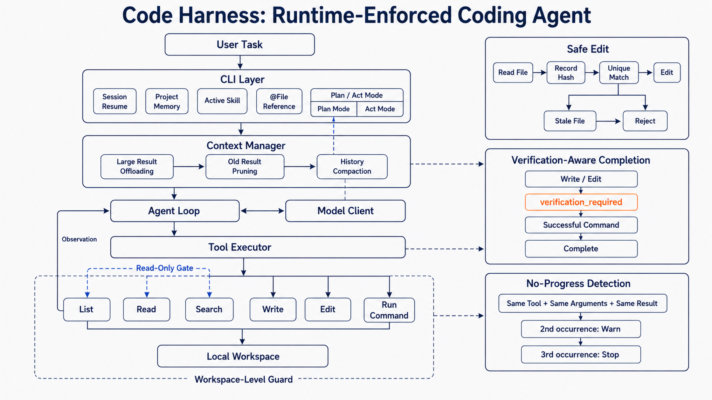

# Code Harness

[简体中文](README.zh-CN.md) | English

A lightweight coding agent harness for autonomous software engineering tasks.

## Features

- OpenAI-compatible model client
- Agent loop with file, search, edit, and command tools
- Workspace isolation and safe file editing
- Multi-turn conversations with saved sessions
- Manual and automatic context compaction
- Project memory and `@file` references
- Read-only Plan Mode with review before execution
- Reusable Skills with explicit activation
- Verification-aware completion after file changes
- No-progress warnings and early termination for repeated tool calls
- Compact CLI output with status and diff views

## Architecture



A task enters through the CLI, which manages interactive features such as
sessions, project memory, Skills, file references, and Plan/Act Mode. The
Context Manager prepares a controlled-size conversation for the Model Client.
The Agent Loop then turns model decisions into tool calls, while the Tool
Executor enforces workspace isolation and the read-only boundary of Plan Mode.

## Core Runtime Mechanisms

- **Context management:** Oversized tool results are stored locally with only a
  preview kept in context. Older tool outputs are pruned before each model
  request, and older conversation history is summarized if the remaining
  context still exceeds the budget. The current task is preserved.
- **Safe Edit:** Reading a file records its version. If the file changes before
  an edit, the stale edit is rejected and the agent must read the latest version
  before continuing.
- **Verification and no-progress safeguards:** After changing files, the agent
  must run an appropriate verification command or explicitly explain why none
  is available. Repeated identical tool calls first trigger a warning and then
  stop the run.

## Setup

Code Harness requires Python 3.10 or later.

```bash
python -m pip install -e .
```

Copy `.env.example` to `.env`, then add your API configuration:

```dotenv
OPENAI_API_KEY=
OPENAI_BASE_URL=
MODEL_NAME=
```

`OPENAI_BASE_URL` is optional when the provider uses the SDK default.

## Usage

Start the interactive CLI:

```bash
code-harness
```

Run one task directly:

```bash
code-harness "Create a hello world script"
```

Use another workspace:

```bash
code-harness --workspace path/to/project
```

The workspace may be anywhere on the filesystem. In an interactive session,
use an absolute path or `..` to switch outside the current workspace:

```text
Task> /open D:\projects\another-project
Task> /open ..\sibling-project
```

File tools stay isolated to the selected workspace. Switch workspaces first if
the agent needs to work on a different project. Agent runs allow 40 model steps
by default; use `--max-steps N` to override the limit for a session.

Inside the CLI, type `/` to view and complete commands:

| Command | Purpose |
| --- | --- |
| `/open <path>` | Switch to an existing workspace |
| `/workspace` | Show the current workspace |
| `/resume` | Resume a saved session |
| `/plan <task>` | Explore with read-only tools and create a plan |
| `/act` | Execute the latest reviewed plan |
| `/cancel` | Discard the current plan |
| `/compact` | Compact the current conversation context |
| `/remember <note>` | Save a project note |
| `/memory` | Show project memory |
| `/skills` | List available Skills |
| `/skill <name\|off>` | Activate a Skill or disable the current one |
| `/status` | Show files changed by the latest task |
| `/diff` | Show text changes from the latest task |
| `/verbose` | Toggle full tool output |
| `/help` | Show available commands |
| `/exit` | Save the session and exit |

Reference a workspace file by adding it to a task:

```text
Task> Review @src/main.py and improve its error handling
```

Plan Mode accepts feedback before execution:

```text
Task> /plan add input validation
Plan> Do not add new dependencies
Plan> /act
```

## Skills

A Skill is a `SKILL.md` file containing reusable instructions for a specific
type of task. Bundled Skills live in `skills/`, while uncommitted local Skills
can be placed in `.agent/skills/`. Only the explicitly selected Skill is added
to the agent instructions, and it cannot bypass workspace or tool restrictions.

```text
skills/
└── python-testing/
    └── SKILL.md
```

```text
Task> /skills
Task> /skill python-testing
Task> Diagnose the failing Python tests
Task> /skill off
```

The selection lasts for the current CLI process.

## Tests

Run the test suite without creating bytecode cache files:

```bash
python -B -m unittest discover -s tests
```

The live API test is disabled by default. Enable it only when `.env` contains a working API configuration:

```powershell
$env:RUN_LIVE_TESTS = "1"
python -B -m unittest tests.test_live_agent -v
```

## Status

Under active development.
